> This note starts from magnetic-flux conservation in cylindrical coordinates. It keeps the intermediate derivation as complete as possible and adds the necessary mathematical steps and conditions of validity where a shortcut would otherwise be easy to miss.

<h2>The problem</h2>

How can a magnetic mirror produce a reflection force along a magnetic field line?

We consider only the **static, non-relativistic case with no electric field**. The  direction is chosen to coincide with the dominant magnetic-field direction near the axis, so 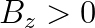 in the region under consideration.

The Lorentz force is

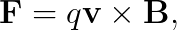

Write the magnetic field in cylindrical coordinates as

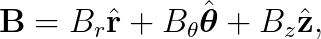

and Maxwell's equation gives

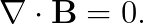

We begin with a small cylindrical volume element.

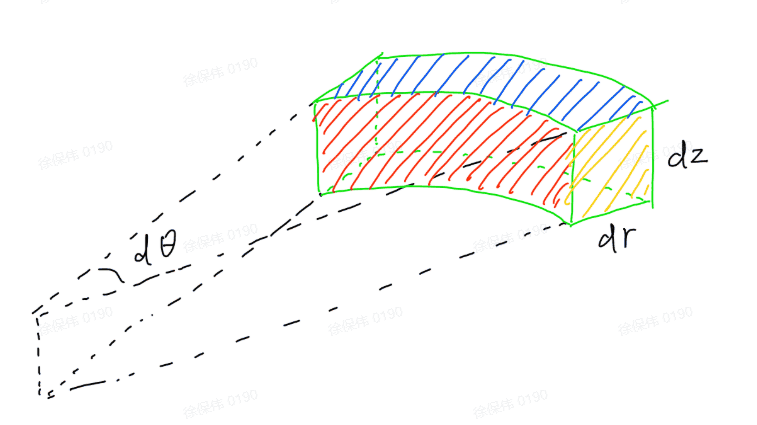

*Figure 1. A differential sector-shaped cylindrical volume element, showing dθ, dr, and dz.*

The ranges of the volume element are

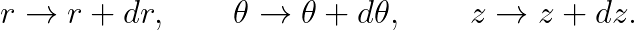

The corresponding differential lengths in the three directions are

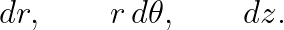

Therefore, the volume is approximately

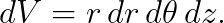

We now calculate the net outward magnetic flux through the six faces of this volume element.

<h2>The basic form of magnetic flux</h2>

The differential magnetic flux is

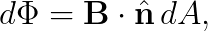

where 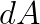 is the area of the surface element and  is the outward unit normal of that surface.

<h2>Magnetic flux through the two radial faces</h2>

*Figure 2. Geometry and outward normal directions of the radial faces.*

<h3>Inner face at </h3>

The area of this face is

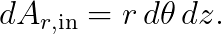

The outward normal of the inner face is , so

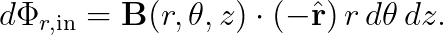

Expand the magnetic field completely:

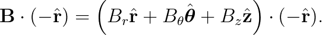

Taking the dot product term by term:

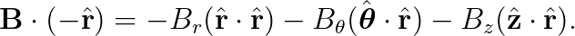

Because the three cylindrical-coordinate unit basis vectors are mutually orthogonal,

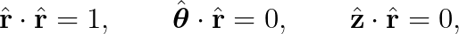

Therefore,

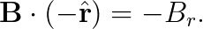

Hence,

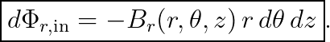

<h3>Outer face at </h3>

The area of this face is

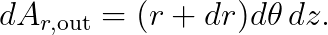

At , the magnetic field is

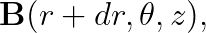

The outward normal is , so

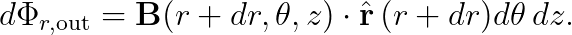

Again, expand the dot product completely:

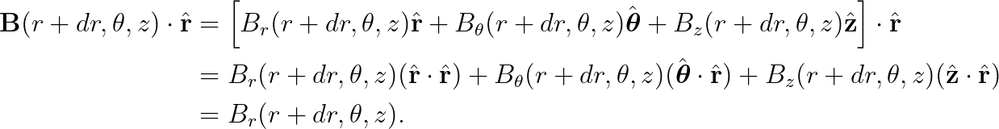

Therefore,

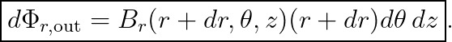

<h3>Net outward flux through the two radial faces</h3>

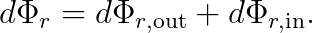

Substituting the fluxes through the two faces gives

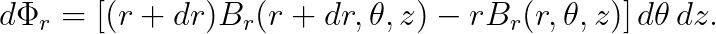

Define

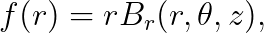

Then

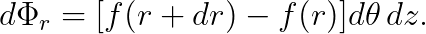

From the definition of the derivative,

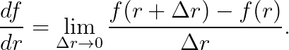

Because  is infinitesimal, we can write the first-order approximation

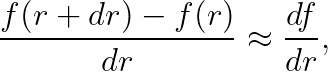

Thus,

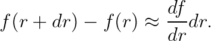

Here 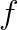 actually comes from the multivariable function 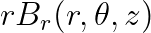. When varying 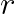, 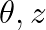 are held fixed, so a partial derivative should be used:

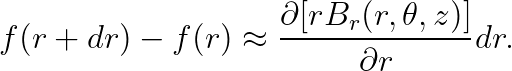

Therefore,

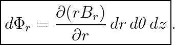

<h2>Magnetic flux through the two -direction faces</h2>

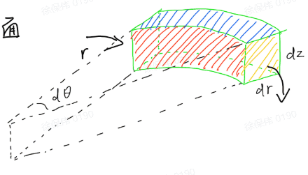

*Figure 3. The θ-direction side faces and their outward normal directions.*

We repeat the same projection procedure for the two -direction faces. Although the form is similar to that for the radial faces, writing it out explicitly makes each normal projection clear.

<h3>Inner face at </h3>

The two edges of this face are  and , so

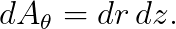

The outward normal of this face is , therefore

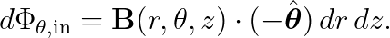

Expand the magnetic field:

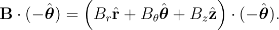

Taking the dot product term by term:

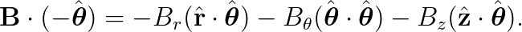

Using

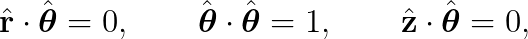

we obtain

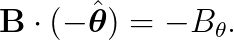

Therefore,

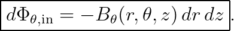

<h3>Outer face at </h3>

The other face is at 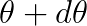, with outward normal 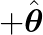:

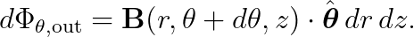

Expand the dot product:

Thus,

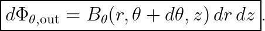

<h3>Net outward flux through the two  faces</h3>

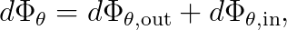

Therefore,

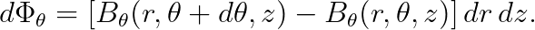

As before, hold the other variables fixed and consider only the variation in :

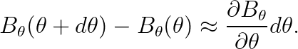

Therefore,

<h2>Magnetic flux through the two -direction faces</h2>

*Figure 4. The upper and lower z-faces and their outward normal directions.*

<h3>Lower face at </h3>

The two edges of the lower face are  and , so

The outward normal of the lower face is , therefore

Expand the dot product:

That is,

Since

we have

Therefore,

<h3>Upper face at </h3>

The outward normal of the upper face is :

Expand the dot product:

Therefore,

<h3>Net outward flux through the two  faces</h3>

Thus,

Using the same finite-difference approximation as above,

Therefore,

<h2>Obtaining the cylindrical-coordinate divergence from the fluxes in the three directions</h2>

The total net outward magnetic flux through the six faces is

Substituting the results from the three directions gives

Factor out the common differential-volume factor:

The divergence is defined as

For the present differential volume element,

Therefore,

Substitute both  and :

Cancel the common factor :

which is the familiar form

<h2>Using the axisymmetry of the magnetic mirror</h2>

The magnetic mirror is invariant under rotation about the  axis, so physical quantities do not depend on . Hence,

In addition, we assume here that there is no azimuthal magnetic field:

These two conditions must be distinguished: axisymmetry gives a zero partial derivative with respect to , whereas  is an additional assumption about the magnetic-field structure.

Thus,

Maxwell's equation also requires

Therefore,

<h2>Using  to obtain  near the axis</h2>

From the equation above,

that is,

*Figure 5. Magnetic field lines near the axis of a magnetic mirror; the red line marks a reference line close to the axis.*

Near the axis, if  varies sufficiently slowly in space, then in the present lowest-order approximation  can be treated as approximately constant with respect to .

More precisely, what is required here is that **near the axis, at fixed , the variation of  with  can be neglected at the order being retained.** Under axisymmetry, near the axis we can write

Therefore,

At the lowest retained order,  can be taken outside the integral with respect to .

To avoid confusing the integration variable with the upper limit, write the  inside the integral as :

The left-hand side integrates directly:

On the axis, ; provided  remains finite, we have

The right-hand side is

Therefore,

We finally obtain

More rigorously, this is the lowest-order result near the axis:

If moving in the  direction,  slowly increases,

then

That is, the radial magnetic-field component points in the  direction.

<h2>Obtaining a force in the  direction from the radial magnetic field</h2>

The particle is also undergoing gyromotion; denote its azimuthal velocity by .

The Lorentz force remains

Under the present axisymmetric,  condition,

Write the velocity as

We consider only the  component of the Lorentz force. The term in the cross product that can produce a  component is

Because

we have

Hence,

Substituting

gives

<h3>Relating  to the Larmor radius</h3>

We next use

To connect this directly to the  in the preceding equation, first consider a **special orbit whose guiding center lies exactly on the axis**. In this near-axis local model, the particle's gyro-orbit is centered on the axis, so the particle's distance from the axis is the Larmor radius,

and

This signed Larmor relation can also be obtained directly from the radial Lorentz force.

Locally approximate the magnetic field as

The circular motion of the particle requires the centripetal acceleration

The radial Lorentz force is

Thus,

When ,

Because the magnitude of the gyromotion velocity is ,

we have

Substitute this back into :

Define the magnetic moment

Then

<h3>Rewriting the -direction result as a force along the magnetic field</h3>

Starting from the near-axis result

we write it as

and then as

Two approximations are implicit in these steps and should be stated explicitly.

First, near the axis the radial component  is small and the magnetic field is mainly in the  direction, so

Thus, at the current lowest order,

Therefore,

Second, define the gradient along the magnetic field line by

Near the axis,

so

At the same time, the  direction is approximately the magnetic-field-line direction, so

Combining these results, under the near-axis and slowly varying-field approximations for the magnetic mirror,

This is the standard magnetic mirror-force form. The explicit calculation above treats the near-axis special case in which the guiding center lies on the axis; for a general guiding-center position, the fast gyro-phase must be averaged. First-order guiding-center theory gives the same standard result .

<h3>What conditions of validity are implicit in this derivation?</h3>

Using local Larmor gyromotion and the magnetic moment  also assumes that the magnetic field varies slowly over one Larmor-radius scale; typically,

where  is the spatial scale over which the magnetic field changes significantly.

Under this adiabatic condition, the particle gyros rapidly while the guiding center experiences a slowly varying magnetic field, and the magnetic moment

can be used as an invariant at first adiabatic order in the non-relativistic approximation.

<h2>Conclusion</h2>

The logic of the derivation can be summarized as follows:

1. Start from ;
2. Compute the magnetic flux through each face of a differential cylindrical volume element and derive the divergence formula;
3. For an axisymmetric magnetic mirror with no azimuthal magnetic field, obtain near the axis

4. The particle's gyromotion velocity  couples to the small radial magnetic field  through the Lorentz force and produces a force in the  direction;
5. Under the guiding-center and adiabatic approximations, average over the fast gyromotion to obtain the standard magnetic mirror force

Therefore, the “reflection force along the magnetic field line” in a magnetic mirror is not a new fundamental force applied directly along the field line. It is an effective parallel force that emerges on the guiding-center scale from the combined action of the nonuniform magnetic field, gyromotion, and .
