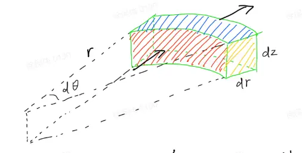
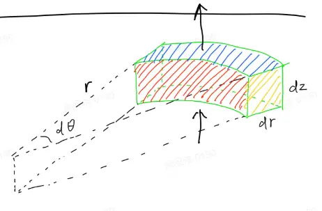

> This note starts from magnetic-flux conservation in cylindrical coordinates. It keeps the intermediate derivation as complete as possible and adds the necessary mathematical steps and conditions of validity where a shortcut would otherwise be easy to miss.

## The problem

How can a magnetic mirror produce a reflection force along a magnetic field line?

We consider only the **static, non-relativistic case with no electric field**. The $+z$ direction is chosen to coincide with the dominant magnetic-field direction near the axis, so $B_z>0$ in the region under consideration.

The Lorentz force is

$$
\mathbf F=q\mathbf v\times\mathbf B,
$$

Write the magnetic field in cylindrical coordinates as

$$
\mathbf B=B_r\hat{\mathbf r}+B_\theta\hat{\boldsymbol\theta}+B_z\hat{\mathbf z},
$$

and Maxwell's equation gives

$$
\nabla\cdot\mathbf B=0.
$$

We begin with a small cylindrical volume element.

*Figure 1. A differential sector-shaped cylindrical volume element, showing $d\theta$, $dr$, and $dz$.*

The ranges of the volume element are

$$
r\to r+dr,\qquad
\theta\to\theta+d\theta,\qquad
z\to z+dz.
$$

The corresponding differential lengths in the three directions are

$$
dr,\qquad r\thinspace{}d\theta,\qquad dz.
$$

Therefore, the volume is approximately

$$
dV=r\thinspace{}dr\thinspace{}d\theta\thinspace{}dz.
$$

We now calculate the net outward magnetic flux through the six faces of this volume element.

## The basic form of magnetic flux

The differential magnetic flux is

$$
d\Phi=\mathbf B\cdot\hat{\mathbf n}\thinspace{}dA,
$$

where $dA$ is the area of the surface element and $\hat{\mathbf n}$ is the outward unit normal of that surface.

## Magnetic flux through the two radial faces

*Figure 2. Geometry and outward normal directions of the radial faces.*

### Inner face at $r$

The area of this face is

$$
dA_{r,\mathrm{in}}=r\thinspace{}d\theta\thinspace{}dz.
$$

The outward normal of the inner face is $-\hat{\mathbf r}$, so

$$
d\Phi_{r,\mathrm{in}}
=
\mathbf B(r,\theta,z)\cdot(-\hat{\mathbf r})
\thinspace{}r\thinspace{}d\theta\thinspace{}dz.
$$

Expand the magnetic field completely:

$$
\mathbf B\cdot(-\hat{\mathbf r})
=
\left(
B_r\hat{\mathbf r}
+
B_\theta\hat{\boldsymbol\theta}
+
B_z\hat{\mathbf z}
\right)
\cdot(-\hat{\mathbf r}).
$$

Taking the dot product term by term:

$$
\mathbf B\cdot(-\hat{\mathbf r})
=
-B_r(\hat{\mathbf r}\cdot\hat{\mathbf r})
-B_\theta(\hat{\boldsymbol\theta}\cdot\hat{\mathbf r})
-B_z(\hat{\mathbf z}\cdot\hat{\mathbf r}).
$$

Because the three cylindrical-coordinate unit basis vectors are mutually orthogonal,

$$
\hat{\mathbf r}\cdot\hat{\mathbf r}=1,
\qquad
\hat{\boldsymbol\theta}\cdot\hat{\mathbf r}=0,
\qquad
\hat{\mathbf z}\cdot\hat{\mathbf r}=0,
$$

Therefore,

$$
\mathbf B\cdot(-\hat{\mathbf r})=-B_r.
$$

Hence,

$$
\boxed{
d\Phi_{r,\mathrm{in}}
=
-B_r(r,\theta,z)\thinspace{}r\thinspace{}d\theta\thinspace{}dz
}.
$$

### Outer face at $r+dr$

The area of this face is

$$
dA_{r,\mathrm{out}}
=
(r+dr)d\theta\thinspace{}dz.
$$

At $r+dr$, the magnetic field is

$$
\mathbf B(r+dr,\theta,z),
$$

The outward normal is $+\hat{\mathbf r}$, so

$$
d\Phi_{r,\mathrm{out}}
=
\mathbf B(r+dr,\theta,z)\cdot\hat{\mathbf r}
\thinspace{}(r+dr)d\theta\thinspace{}dz.
$$

Again, expand the dot product completely:

$$
\begin{aligned}
\mathbf B(r+dr,\theta,z)\cdot\hat{\mathbf r}
&=
\left[
B_r(r+dr,\theta,z)\hat{\mathbf r}
+
B_\theta(r+dr,\theta,z)\hat{\boldsymbol\theta}
+
B_z(r+dr,\theta,z)\hat{\mathbf z}
\right]\cdot\hat{\mathbf r}\\
&=
B_r(r+dr,\theta,z)(\hat{\mathbf r}\cdot\hat{\mathbf r})
+
B_\theta(r+dr,\theta,z)(\hat{\boldsymbol\theta}\cdot\hat{\mathbf r})
+
B_z(r+dr,\theta,z)(\hat{\mathbf z}\cdot\hat{\mathbf r})\\
&=
B_r(r+dr,\theta,z).
\end{aligned}
$$

Therefore,

$$
\boxed{
d\Phi_{r,\mathrm{out}}
=
B_r(r+dr,\theta,z)(r+dr)d\theta\thinspace{}dz
}.
$$

### Net outward flux through the two radial faces

$$
d\Phi_r
=
d\Phi_{r,\mathrm{out}}
+
d\Phi_{r,\mathrm{in}}.
$$

Substituting the fluxes through the two faces gives

$$
d\Phi_r
=
\left[
(r+dr)B_r(r+dr,\theta,z)
-
rB_r(r,\theta,z)
\right]d\theta\thinspace{}dz.
$$

Define

$$
f(r)=rB_r(r,\theta,z),
$$

Then

$$
d\Phi_r
=
[f(r+dr)-f(r)]d\theta\thinspace{}dz.
$$

From the definition of the derivative,

$$
\frac{df}{dr}
=
\lim_{\Delta r\to0}
\frac{f(r+\Delta r)-f(r)}{\Delta r}.
$$

Because $dr$ is infinitesimal, we can write the first-order approximation

$$
\frac{f(r+dr)-f(r)}{dr}
\approx
\frac{df}{dr},
$$

Thus,

$$
f(r+dr)-f(r)
\approx
\frac{df}{dr}dr.
$$

Here $f$ actually comes from the multivariable function $rB_r(r,\theta,z)$. When varying $r$, $\theta,z$ are held fixed, so a partial derivative should be used:

$$
f(r+dr)-f(r)
\approx
\frac{\partial[rB_r(r,\theta,z)]}{\partial r}dr.
$$

Therefore,

$$
\boxed{
d\Phi_r
=
\frac{\partial(rB_r)}{\partial r}
\thinspace{}dr\thinspace{}d\theta\thinspace{}dz
}.
$$

## Magnetic flux through the two $\theta$-direction faces

*Figure 3. The $\theta$-direction side faces and their outward normal directions.*

We repeat the same projection procedure for the two $\theta$-direction faces. Although the form is similar to that for the radial faces, writing it out explicitly makes each normal projection clear.

### Inner face at $\theta$

The two edges of this face are $dr$ and $dz$, so

$$
dA_\theta=dr\thinspace{}dz.
$$

The outward normal of this face is $-\hat{\boldsymbol\theta}$, therefore

$$
d\Phi_{\theta,\mathrm{in}}
=
\mathbf B(r,\theta,z)\cdot(-\hat{\boldsymbol\theta})
\thinspace{}dr\thinspace{}dz.
$$

Expand the magnetic field:

$$
\mathbf B\cdot(-\hat{\boldsymbol\theta})
=
\left(
B_r\hat{\mathbf r}
+
B_\theta\hat{\boldsymbol\theta}
+
B_z\hat{\mathbf z}
\right)
\cdot(-\hat{\boldsymbol\theta}).
$$

Taking the dot product term by term:

$$
\mathbf B\cdot(-\hat{\boldsymbol\theta})
=
-B_r(\hat{\mathbf r}\cdot\hat{\boldsymbol\theta})
-B_\theta(\hat{\boldsymbol\theta}\cdot\hat{\boldsymbol\theta})
-B_z(\hat{\mathbf z}\cdot\hat{\boldsymbol\theta}).
$$

Using

$$
\hat{\mathbf r}\cdot\hat{\boldsymbol\theta}=0,
\qquad
\hat{\boldsymbol\theta}\cdot\hat{\boldsymbol\theta}=1,
\qquad
\hat{\mathbf z}\cdot\hat{\boldsymbol\theta}=0,
$$

we obtain

$$
\mathbf B\cdot(-\hat{\boldsymbol\theta})=-B_\theta.
$$

Therefore,

$$
\boxed{
d\Phi_{\theta,\mathrm{in}}
=
-B_\theta(r,\theta,z)\thinspace{}dr\thinspace{}dz
}.
$$

### Outer face at $\theta+d\theta$

The other face is at $\theta+d\theta$, with outward normal $+\hat{\boldsymbol\theta}$:

$$
d\Phi_{\theta,\mathrm{out}}
=
\mathbf B(r,\theta+d\theta,z)\cdot\hat{\boldsymbol\theta}
\thinspace{}dr\thinspace{}dz.
$$

Expand the dot product:

$$
\begin{aligned}
\mathbf B(r,\theta+d\theta,z)\cdot\hat{\boldsymbol\theta}
&=
\left[
B_r(r,\theta+d\theta,z)\hat{\mathbf r}
+
B_\theta(r,\theta+d\theta,z)\hat{\boldsymbol\theta}
+
B_z(r,\theta+d\theta,z)\hat{\mathbf z}
\right]\cdot\hat{\boldsymbol\theta}\\
&=
B_r(r,\theta+d\theta,z)(\hat{\mathbf r}\cdot\hat{\boldsymbol\theta})
+
B_\theta(r,\theta+d\theta,z)
(\hat{\boldsymbol\theta}\cdot\hat{\boldsymbol\theta})
+
B_z(r,\theta+d\theta,z)(\hat{\mathbf z}\cdot\hat{\boldsymbol\theta})\\
&=
B_\theta(r,\theta+d\theta,z).
\end{aligned}
$$

Thus,

$$
\boxed{
d\Phi_{\theta,\mathrm{out}}
=
B_\theta(r,\theta+d\theta,z)\thinspace{}dr\thinspace{}dz
}.
$$

### Net outward flux through the two $\theta$ faces

$$
d\Phi_\theta
=
d\Phi_{\theta,\mathrm{out}}
+
d\Phi_{\theta,\mathrm{in}},
$$

Therefore,

$$
d\Phi_\theta
=
\left[
B_\theta(r,\theta+d\theta,z)
-
B_\theta(r,\theta,z)
\right]dr\thinspace{}dz.
$$

As before, hold the other variables fixed and consider only the variation in $\theta$:

$$
B_\theta(\theta+d\theta)-B_\theta(\theta)
\approx
\frac{\partial B_\theta}{\partial\theta}d\theta.
$$

Therefore,

$$
\boxed{
d\Phi_\theta
=
\frac{\partial B_\theta}{\partial\theta}
\thinspace{}dr\thinspace{}d\theta\thinspace{}dz
}.
$$

## Magnetic flux through the two $z$-direction faces

*Figure 4. The upper and lower $z$-faces and their outward normal directions.*

### Lower face at $z$

The two edges of the lower face are $dr$ and $r\,d\theta$, so

$$
dA_z
=
r\thinspace{}dr\thinspace{}d\theta.
$$

The outward normal of the lower face is $-\hat{\mathbf z}$, therefore

$$
d\Phi_{z,\mathrm{in}}
=
\mathbf B(r,\theta,z)\cdot(-\hat{\mathbf z})
\thinspace{}r\thinspace{}dr\thinspace{}d\theta.
$$

Expand the dot product:

$$
\mathbf B\cdot(-\hat{\mathbf z})
=
\left(
B_r\hat{\mathbf r}
+
B_\theta\hat{\boldsymbol\theta}
+
B_z\hat{\mathbf z}
\right)
\cdot(-\hat{\mathbf z}),
$$

That is,

$$
\mathbf B\cdot(-\hat{\mathbf z})
=
-B_r(\hat{\mathbf r}\cdot\hat{\mathbf z})
-B_\theta(\hat{\boldsymbol\theta}\cdot\hat{\mathbf z})
-B_z(\hat{\mathbf z}\cdot\hat{\mathbf z}).
$$

Since

$$
\hat{\mathbf r}\cdot\hat{\mathbf z}=0,
\qquad
\hat{\boldsymbol\theta}\cdot\hat{\mathbf z}=0,
\qquad
\hat{\mathbf z}\cdot\hat{\mathbf z}=1,
$$

we have

$$
\mathbf B\cdot(-\hat{\mathbf z})=-B_z.
$$

Therefore,

$$
\boxed{
d\Phi_{z,\mathrm{in}}
=
-B_z(r,\theta,z)\thinspace{}r\thinspace{}dr\thinspace{}d\theta
}.
$$

### Upper face at $z+dz$

The outward normal of the upper face is $+\hat{\mathbf z}$:

$$
d\Phi_{z,\mathrm{out}}
=
\mathbf B(r,\theta,z+dz)\cdot\hat{\mathbf z}
\thinspace{}r\thinspace{}dr\thinspace{}d\theta.
$$

Expand the dot product:

$$
\begin{aligned}
\mathbf B(r,\theta,z+dz)\cdot\hat{\mathbf z}
&=
\left[
B_r(r,\theta,z+dz)\hat{\mathbf r}
+
B_\theta(r,\theta,z+dz)\hat{\boldsymbol\theta}
+
B_z(r,\theta,z+dz)\hat{\mathbf z}
\right]\cdot\hat{\mathbf z}\\
&=
B_r(r,\theta,z+dz)(\hat{\mathbf r}\cdot\hat{\mathbf z})
+
B_\theta(r,\theta,z+dz)(\hat{\boldsymbol\theta}\cdot\hat{\mathbf z})
+
B_z(r,\theta,z+dz)(\hat{\mathbf z}\cdot\hat{\mathbf z})\\
&=
B_z(r,\theta,z+dz).
\end{aligned}
$$

Therefore,

$$
\boxed{
d\Phi_{z,\mathrm{out}}
=
B_z(r,\theta,z+dz)\thinspace{}r\thinspace{}dr\thinspace{}d\theta
}.
$$

### Net outward flux through the two $z$ faces

$$
d\Phi_z
=
d\Phi_{z,\mathrm{out}}
+
d\Phi_{z,\mathrm{in}},
$$

Thus,

$$
d\Phi_z
=
\left[
B_z(r,\theta,z+dz)
-
B_z(r,\theta,z)
\right]
r\thinspace{}dr\thinspace{}d\theta.
$$

Using the same finite-difference approximation as above,

$$
B_z(r,\theta,z+dz)-B_z(r,\theta,z)
\approx
\frac{\partial B_z}{\partial z}dz.
$$

Therefore,

$$
\boxed{
d\Phi_z
=
r\frac{\partial B_z}{\partial z}
\thinspace{}dr\thinspace{}d\theta\thinspace{}dz
}.
$$

## Obtaining the cylindrical-coordinate divergence from the fluxes in the three directions

The total net outward magnetic flux through the six faces is

$$
d\Phi
=
d\Phi_r+d\Phi_\theta+d\Phi_z.
$$

Substituting the results from the three directions gives

$$
\begin{aligned}
d\Phi
&=
\frac{\partial(rB_r)}{\partial r}
\thinspace{}dr\thinspace{}d\theta\thinspace{}dz\\
&\quad+
\frac{\partial B_\theta}{\partial\theta}
\thinspace{}dr\thinspace{}d\theta\thinspace{}dz\\
&\quad+
r\frac{\partial B_z}{\partial z}
\thinspace{}dr\thinspace{}d\theta\thinspace{}dz.
\end{aligned}
$$

Factor out the common differential-volume factor:

$$
d\Phi
=
\left[
\frac{\partial(rB_r)}{\partial r}
+
\frac{\partial B_\theta}{\partial\theta}
+
r\frac{\partial B_z}{\partial z}
\right]
dr\thinspace{}d\theta\thinspace{}dz.
$$

The divergence is defined as

$$
\nabla\cdot\mathbf B
=
\lim_{dV\to0}
\frac{\text{net outward magnetic flux}}{\text{volume}}.
$$

For the present differential volume element,

$$
dV=r\thinspace{}dr\thinspace{}d\theta\thinspace{}dz,
$$

Therefore,

$$
\nabla\cdot\mathbf B
=
\frac{d\Phi}{dV}.
$$

Substitute both $d\Phi$ and $dV$:

$$
\nabla\cdot\mathbf B
=
\frac{
\left[
\frac{\partial(rB_r)}{\partial r}
+
\frac{\partial B_\theta}{\partial\theta}
+
r\frac{\partial B_z}{\partial z}
\right]
dr\thinspace{}d\theta\thinspace{}dz
}{
r\thinspace{}dr\thinspace{}d\theta\thinspace{}dz
}.
$$

Cancel the common factor $dr\,d\theta\,dz$:

$$
\boxed{
\nabla\cdot\mathbf B
=
\frac1r
\left[
\frac{\partial(rB_r)}{\partial r}
+
\frac{\partial B_\theta}{\partial\theta}
+
r\frac{\partial B_z}{\partial z}
\right]
}.
$$

which is the familiar form

$$
\boxed{
\nabla\cdot\mathbf B
=
\frac1r\frac{\partial(rB_r)}{\partial r}
+
\frac1r\frac{\partial B_\theta}{\partial\theta}
+
\frac{\partial B_z}{\partial z}
}.
$$

## Using the axisymmetry of the magnetic mirror

The magnetic mirror is invariant under rotation about the $z$ axis, so physical quantities do not depend on $\theta$. Hence,

$$
\frac{\partial B_\theta}{\partial\theta}=0.
$$

In addition, we assume here that there is no azimuthal magnetic field:

$$
B_\theta=0.
$$

These two conditions must be distinguished: axisymmetry gives a zero partial derivative with respect to $\theta$, whereas $B_\theta=0$ is an additional assumption about the magnetic-field structure.

Thus,

$$
\nabla\cdot\mathbf B
=
\frac1r\frac{\partial(rB_r)}{\partial r}
+
\frac{\partial B_z}{\partial z}.
$$

Maxwell's equation also requires

$$
\nabla\cdot\mathbf B=0,
$$

Therefore,

$$
\boxed{
\frac1r\frac{\partial(rB_r)}{\partial r}
+
\frac{\partial B_z}{\partial z}
=0
}.
$$

## Using $\nabla\cdot\mathbf B=0$ to obtain $B_r$ near the axis

From the equation above,

$$
\frac1r\frac{\partial(rB_r)}{\partial r}
=
-\frac{\partial B_z}{\partial z},
$$

that is,

$$
\frac{\partial(rB_r)}{\partial r}
=
-r\frac{\partial B_z}{\partial z}.
$$

*Figure 5. Magnetic field lines near the axis of a magnetic mirror; the red line marks a reference line close to the axis.*

Near the axis, if $B_z$ varies sufficiently slowly in space, then in the present lowest-order approximation $\partial B_z/\partial z$ can be treated as approximately constant with respect to $r$.

More precisely, what is required here is that **near the axis, at fixed $z$, the variation of $\partial B_z/\partial z$ with $r$ can be neglected at the order being retained.** Under axisymmetry, near the axis we can write

$$
B_z(r,z)=B_0(z)+O(r^2),
$$

Therefore,

$$
\frac{\partial B_z}{\partial z}
=
\frac{dB_0}{dz}
+
O(r^2).
$$

At the lowest retained order, $\partial B_z/\partial z$ can be taken outside the integral with respect to $r$.

To avoid confusing the integration variable with the upper limit, write the $r$ inside the integral as $r'$:

$$
\int_0^r
\frac{\partial(r'B_r)}{\partial r'}dr'
\simeq
-\left[\frac{\partial B_z}{\partial z}\right]_{r=0}
\int_0^r r'\thinspace{}dr'.
$$

The left-hand side integrates directly:

$$
\int_0^r
\frac{\partial(r'B_r)}{\partial r'}dr'
=
rB_r(r)-\left.r'B_r(r')\right|_{r'=0}.
$$

On the axis, $r'=0$; provided $B_r$ remains finite, we have

$$
\left.r'B_r(r')\right|_{r'=0}=0.
$$

The right-hand side is

$$
-\left[\frac{\partial B_z}{\partial z}\right]_{r=0}
\int_0^r r'\thinspace{}dr'
=
-\frac{r^2}{2}
\left[\frac{\partial B_z}{\partial z}\right]_{r=0}.
$$

Therefore,

$$
rB_r(r,z)
\simeq
-\frac12r^2
\left[\frac{\partial B_z}{\partial z}\right]_{r=0},
$$

We finally obtain

$$
\boxed{
B_r(r,z)
\simeq
-\frac r2
\left[\frac{\partial B_z}{\partial z}\right]_{r=0}
}.
$$

More rigorously, this is the lowest-order result near the axis:

$$
B_r(r,z)
=
-\frac r2\frac{dB_0}{dz}
+
O(r^3).
$$

If moving in the $+z$ direction, $B_z$ slowly increases,

$$
\frac{\partial B_z}{\partial z}>0,
$$

then

$$
B_r<0,
$$

That is, the radial magnetic-field component points in the $-\hat{\mathbf r}$ direction.

## Obtaining a force in the $z$ direction from the radial magnetic field

The particle is also undergoing gyromotion; denote its azimuthal velocity by $v_\theta$.

The Lorentz force remains

$$
\mathbf F=q\mathbf v\times\mathbf B.
$$

Under the present axisymmetric, $B_\theta=0$ condition,

$$
\mathbf B=B_r\hat{\mathbf r}+B_z\hat{\mathbf z}.
$$

Write the velocity as

$$
\mathbf v
=
v_r\hat{\mathbf r}
+
v_\theta\hat{\boldsymbol\theta}
+
v_z\hat{\mathbf z}.
$$

We consider only the $z$ component of the Lorentz force. The term in the cross product that can produce a $\hat{\mathbf z}$ component is

$$
v_\theta\hat{\boldsymbol\theta}
\times
B_r\hat{\mathbf r}.
$$

Because

$$
\hat{\boldsymbol\theta}\times\hat{\mathbf r}
=
-\hat{\mathbf z},
$$

we have

$$
(\mathbf v\times\mathbf B)_z
=
-v_\theta B_r.
$$

Hence,

$$
\boxed{
F_z=-qv_\theta B_r
}.
$$

Substituting

$$
B_r
\simeq
-\frac r2
\left[\frac{\partial B_z}{\partial z}\right]_{r=0},
$$

gives

$$
F_z
\simeq
qv_\theta\frac r2
\left[\frac{\partial B_z}{\partial z}\right]_{r=0}.
$$

### Relating $r$ to the Larmor radius

We next use

$$
qv_\theta r_L
=
-\frac{mv_\perp^2}{B}.
$$

To connect this directly to the $r$ in the preceding equation, first consider a **special orbit whose guiding center lies exactly on the axis**. In this near-axis local model, the particle's gyro-orbit is centered on the axis, so the particle's distance from the axis is the Larmor radius,

$$
r=r_L,
$$

and

$$
|v_\theta|=v_\perp.
$$

This signed Larmor relation can also be obtained directly from the radial Lorentz force.

Locally approximate the magnetic field as

$$
\mathbf B\simeq B\hat{\mathbf z},
$$

The circular motion of the particle requires the centripetal acceleration

$$
a_r=-\frac{v_\theta^2}{r_L}.
$$

The radial Lorentz force is

$$
F_r
=
qv_\theta B.
$$

Thus,

$$
qv_\theta B
=
-m\frac{v_\theta^2}{r_L}.
$$

When $v_\theta\neq0$,

$$
qv_\theta r_L
=
-\frac{mv_\theta^2}{B}.
$$

Because the magnitude of the gyromotion velocity is $v_\perp$,

$$
v_\theta^2=v_\perp^2,
$$

we have

$$
\boxed{
qv_\theta r_L
=
-\frac{mv_\perp^2}{B}
}.
$$

Substitute this back into $F_z$:

$$
\begin{aligned}
F_z
&\simeq
\frac12
(qv_\theta r_L)
\left[\frac{\partial B_z}{\partial z}\right]_{r=0}\\
&=
-\frac{mv_\perp^2}{2B}
\left[\frac{\partial B_z}{\partial z}\right]_{r=0}.
\end{aligned}
$$

Define the magnetic moment

$$
\boxed{
\mu=\frac{mv_\perp^2}{2B}
},
$$

Then

$$
F_z
\simeq
-\mu
\left[\frac{\partial B_z}{\partial z}\right]_{r=0}.
$$

### Rewriting the $z$-direction result as a force along the magnetic field

Starting from the near-axis result

$$
-\mu
\left[\frac{\partial B_z}{\partial z}\right]_{r=0}
$$

we write it as

$$
-\mu\frac{\partial B}{\partial z},
$$

and then as

$$
-\mu\nabla_\parallel B.
$$

Two approximations are implicit in these steps and should be stated explicitly.

First, near the axis the radial component $B_r$ is small and the magnetic field is mainly in the $z$ direction, so

$$
B
=
|\mathbf B|
=
\sqrt{B_z^2+B_r^2}
\simeq
B_z,
$$

Thus, at the current lowest order,

$$
\frac{\partial B}{\partial z}
\simeq
\frac{\partial B_z}{\partial z}.
$$

Therefore,

$$
F_z
\simeq
-\mu\frac{\partial B}{\partial z}.
$$

Second, define the gradient along the magnetic field line by

$$
\boxed{
\nabla_\parallel B
\equiv
\hat{\mathbf b}\cdot\nabla B
},
\qquad
\hat{\mathbf b}=\frac{\mathbf B}{B}.
$$

Near the axis,

$$
\hat{\mathbf b}\simeq\hat{\mathbf z},
$$

so

$$
\nabla_\parallel B
\simeq
\frac{\partial B}{\partial z}.
$$

At the same time, the $z$ direction is approximately the magnetic-field-line direction, so

$$
F_\parallel\simeq F_z.
$$

Combining these results, under the near-axis and slowly varying-field approximations for the magnetic mirror,

$$
\boxed{
F_\parallel
=
-\mu\nabla_\parallel B
}.
$$

This is the standard magnetic mirror-force form. The explicit calculation above treats the near-axis special case in which the guiding center lies on the axis; for a general guiding-center position, the fast gyro-phase must be averaged. First-order guiding-center theory gives the same standard result $F_{\parallel,\mathrm{mirror}}=-\mu\nabla_\parallel B$.

### What conditions of validity are implicit in this derivation?

Using local Larmor gyromotion and the magnetic moment $\mu$ also assumes that the magnetic field varies slowly over one Larmor-radius scale; typically,

$$
\frac{r_L}{L_B}\ll1,
$$

where $L_B$ is the spatial scale over which the magnetic field changes significantly.

Under this adiabatic condition, the particle gyros rapidly while the guiding center experiences a slowly varying magnetic field, and the magnetic moment

$$
\mu=\frac{mv_\perp^2}{2B}
$$

can be used as an invariant at first adiabatic order in the non-relativistic approximation.

## Conclusion

The logic of the derivation can be summarized as follows:

1. Start from $\nabla\cdot\mathbf B=0$;
2. Compute the magnetic flux through each face of a differential cylindrical volume element and derive the divergence formula;
3. For an axisymmetric magnetic mirror with no azimuthal magnetic field, obtain near the axis

$$
B_r
\simeq
-\frac r2
\left[\frac{\partial B_z}{\partial z}\right]_{r=0};
$$

4. The particle's gyromotion velocity $v_\theta$ couples to the small radial magnetic field $B_r$ through the Lorentz force and produces a force in the $z$ direction;
5. Under the guiding-center and adiabatic approximations, average over the fast gyromotion to obtain the standard magnetic mirror force

$$
\boxed{
F_\parallel=-\mu\nabla_\parallel B
}.
$$

Therefore, the “reflection force along the magnetic field line” in a magnetic mirror is not a new fundamental force applied directly along the field line. It is an effective parallel force that emerges on the guiding-center scale from the combined action of the nonuniform magnetic field, gyromotion, and $\nabla\cdot\mathbf B=0$.
