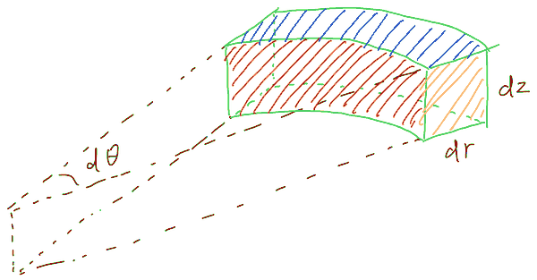
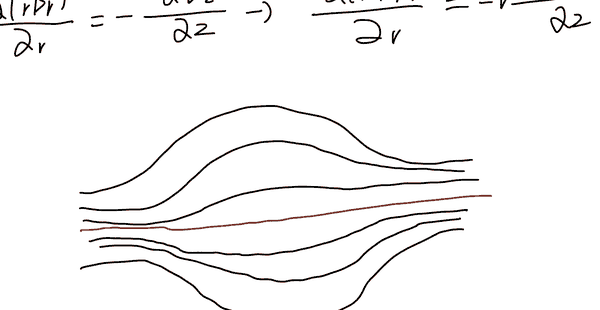

> 本文由 2026-09-17 的手写笔记整理为 Markdown。主要进行了排版、公式转写与符号统一，不改变原手稿的推导主线。原手稿中少量将向量 $\mathbf B$ 与分量 $B_z$ 混写的位置，以下按相邻展开式统一记为 $\mathbf B$。

## 问题

磁镜为什么能够产生沿磁力线方向的反射力？

已知洛伦兹力

$$
\mathbf F=q\mathbf v\times\mathbf B,
$$

磁场写成柱坐标形式

$$
\mathbf B=B_r\hat{\mathbf r}+B_\theta\hat{\boldsymbol\theta}+B_z\hat{\mathbf z},
$$

以及 Maxwell 方程

$$
\nabla\cdot\mathbf B=0.
$$

下面从一个很小的柱坐标体元开始。

*图 1　原手稿中的柱坐标微小扇形体元，标出了 $d\theta$、$dr$ 和 $dz$。*

体元的范围为

$$
r\to r+dr,\qquad
\theta\to\theta+d\theta,\qquad
z\to z+dz.
$$

三个方向上的微小长度分别为

$$
dr,\qquad r\thinspace{}d\theta,\qquad dz,
$$

所以体积近似为

$$
dV=r\thinspace{}dr\thinspace{}d\theta\thinspace{}dz.
$$

现在计算这个体元六个面的净流出磁通。

## 磁通的基本形式

磁通微元为

$$
d\Phi=\mathbf B\cdot\hat{\mathbf n}\thinspace{}dA,
$$

其中 $dA$ 是面元面积，$\hat{\mathbf n}$ 是该面的外法向。

## 径向两个面的磁通

*图 2　原手稿中用于分析径向两个面的体元示意。*

先看位于 $r$ 处的内侧面。其面积为

$$
dA_{r,\mathrm{in}}=r\thinspace{}d\theta\thinspace{}dz.
$$

内侧面的外法向是 $-\hat{\mathbf r}$，因此

$$
d\Phi_{r,\mathrm{in}} =
\mathbf B(r,\theta,z)\cdot(-\hat{\mathbf r})\thinspace{}r\thinspace{}d\theta\thinspace{}dz.
$$

因为 $\hat{\mathbf r}$、$\hat{\boldsymbol\theta}$、$\hat{\mathbf z}$ 两两正交，

$$
\mathbf B\cdot(-\hat{\mathbf r}) =
-B_r,
$$

所以

$$
d\Phi_{r,\mathrm{in}} =
-B_r(r,\theta,z)\thinspace{}r\thinspace{}d\theta\thinspace{}dz.
$$

再看位于 $r+dr$ 处的外侧面，其面积为

$$
dA_{r,\mathrm{out}}=(r+dr)d\theta\thinspace{}dz.
$$

该处的磁场为 $\mathbf B(r+dr,\theta,z)$，外法向为 $+\hat{\mathbf r}$，因此

$$
d\Phi_{r,\mathrm{out}} =
\mathbf B(r+dr,\theta,z)\cdot\hat{\mathbf r}\thinspace{}(r+dr)d\theta\thinspace{}dz.
$$

又因为

$$
\mathbf B(r+dr,\theta,z)\cdot\hat{\mathbf r} =
B_r(r+dr,\theta,z),
$$

所以

$$
d\Phi_{r,\mathrm{out}} =
B_r(r+dr,\theta,z)(r+dr)d\theta\thinspace{}dz.
$$

两个径向面的净流出为

$$
\begin{aligned}
d\Phi_r
&=d\Phi_{r,\mathrm{out}}+d\Phi_{r,\mathrm{in}}\\
&=\left[(r+dr)B_r(r+dr,\theta,z)-rB_r(r,\theta,z)\right]d\theta\thinspace{}dz.
\end{aligned}
$$

定义

$$
f(r)=rB_r(r,\theta,z),
$$

则

$$
d\Phi_r=[f(r+dr)-f(r)]d\theta\thinspace{}dz.
$$

由导数定义

$$
\frac{df}{dr} =
\lim_{\Delta r\to0}
\frac{f(r+\Delta r)-f(r)}{\Delta r},
$$

令 $\Delta r\approx dr$，则

$$
f(r+dr)-f(r)\approx\frac{df}{dr}dr.
$$

因此

$$
\boxed{d\Phi_r = \frac{\partial(rB_r)}{\partial r}\thinspace{}dr\thinspace{}d\theta\thinspace{}dz}.
$$

## $\theta$ 方向两个面的磁通

> 原手稿图示：$\theta$ 方向两侧面分别位于 $\theta$ 与 $\theta+d\theta$，对应外法向为 $-\hat{\boldsymbol\theta}$ 与 $+\hat{\boldsymbol\theta}$。

位于 $\theta$ 处的面，其面积为

$$
dA_\theta=dr\thinspace{}dz,
$$

外法向为 $-\hat{\boldsymbol\theta}$。因此

$$
d\Phi_{\theta,\mathrm{in}} =
\mathbf B(r,\theta,z)\cdot(-\hat{\boldsymbol\theta})\thinspace{}dr\thinspace{}dz =
-B_\theta(r,\theta,z)\thinspace{}dr\thinspace{}dz.
$$

另一面位于 $\theta+d\theta$，外法向为 $+\hat{\boldsymbol\theta}$，所以

$$
d\Phi_{\theta,\mathrm{out}} =
\mathbf B(r,\theta+d\theta,z)\cdot\hat{\boldsymbol\theta}\thinspace{}dr\thinspace{}dz =
B_\theta(r,\theta+d\theta,z)\thinspace{}dr\thinspace{}dz.
$$

因此净流出为

$$
\begin{aligned}
d\Phi_\theta
&=d\Phi_{\theta,\mathrm{out}}+d\Phi_{\theta,\mathrm{in}}\\
&=\left[B_\theta(r,\theta+d\theta,z)-B_\theta(r,\theta,z)\right]dr\thinspace{}dz.
\end{aligned}
$$

与前面相同，令 $B_\theta=f(\theta)$，则

$$
B_\theta(\theta+d\theta)-B_\theta(\theta)
\approx
\frac{\partial B_\theta}{\partial\theta}d\theta.
$$

于是

$$
\boxed{d\Phi_\theta = \frac{\partial B_\theta}{\partial\theta}\thinspace{}dr\thinspace{}d\theta\thinspace{}dz}.
$$

## $z$ 方向两个面的磁通

*图 3　原手稿中上下表面及其外法向的示意。*

底面位于 $z$，顶面位于 $z+dz$。底面的两条边分别为 $dr$ 和 $r\thinspace{}d\theta$，所以

$$
dA_z=r\thinspace{}dr\thinspace{}d\theta.
$$

底面的外法向为 $-\hat{\mathbf z}$，因此

$$
d\Phi_{z,\mathrm{in}} =
\mathbf B(r,\theta,z)\cdot(-\hat{\mathbf z})\thinspace{}r\thinspace{}dr\thinspace{}d\theta.
$$

由于

$$
\mathbf B(r,\theta,z)\cdot(-\hat{\mathbf z})=-B_z(r,\theta,z),
$$

所以

$$
d\Phi_{z,\mathrm{in}} =
-B_z(r,\theta,z)\thinspace{}r\thinspace{}dr\thinspace{}d\theta.
$$

顶面位于 $z+dz$，外法向为 $+\hat{\mathbf z}$，因此

$$
d\Phi_{z,\mathrm{out}} =
B_z(r,\theta,z+dz)\thinspace{}r\thinspace{}dr\thinspace{}d\theta.
$$

净流出为

$$
\begin{aligned}
d\Phi_z
&=d\Phi_{z,\mathrm{out}}+d\Phi_{z,\mathrm{in}}\\
&=\left[B_z(r,\theta,z+dz)-B_z(r,\theta,z)\right]r\thinspace{}dr\thinspace{}d\theta.
\end{aligned}
$$

根据与前面相同的导数近似，

$$
B_z(r,\theta,z+dz)-B_z(r,\theta,z)
\approx
\frac{\partial B_z}{\partial z}dz,
$$

因此

$$
\boxed{d\Phi_z = r\frac{\partial B_z}{\partial z}\thinspace{}dr\thinspace{}d\theta\thinspace{}dz}.
$$

## 得到柱坐标下的 $\nabla\cdot\mathbf B$

六个面的总净流出磁通为

$$
d\Phi=d\Phi_r+d\Phi_\theta+d\Phi_z.
$$

代入上面的三个结果，得到

$$
\begin{aligned}
d\Phi
&= \frac{\partial(rB_r)}{\partial r}dr\thinspace{}d\theta\thinspace{}dz \\
&\quad + \frac{\partial B_\theta}{\partial\theta}dr\thinspace{}d\theta\thinspace{}dz \\
&\quad + r\frac{\partial B_z}{\partial z}dr\thinspace{}d\theta\thinspace{}dz \\
&= \left[
\frac{\partial(rB_r)}{\partial r}
{}+ \frac{\partial B_\theta}{\partial\theta}
{}+ r\frac{\partial B_z}{\partial z}
\right]dr\thinspace{}d\theta\thinspace{}dz.
\end{aligned}
$$

散度的定义是

$$
\nabla\cdot\mathbf B =
\lim_{dV\to0}
\frac{\text{净流出磁通}}{\text{体积}}.
$$

由于

$$
dV=r\thinspace{}dr\thinspace{}d\theta\thinspace{}dz,
$$

所以

$$
\boxed{
\nabla\cdot\mathbf B =
\frac1r\left[
\frac{\partial(rB_r)}{\partial r}
{}+ \frac{\partial B_\theta}{\partial\theta}
{}+ r\frac{\partial B_z}{\partial z}
\right]
}.
$$

磁镜是轴对称的，即沿 $z$ 轴转动之后磁场不变，因此

$$
\frac{\partial B_\theta}{\partial\theta}=0.
$$

另外设定磁镜中没有环向磁场，即

$$
B_\theta=0.
$$

于是

$$
\nabla\cdot\mathbf B =
\frac1r\frac{\partial(rB_r)}{\partial r}
{}+ \frac{\partial B_z}{\partial z}.
$$

Maxwell 方程又规定

$$
\nabla\cdot\mathbf B=0,
$$

因此

$$
\boxed{
\frac1r\frac{\partial(rB_r)}{\partial r}
{}+ \frac{\partial B_z}{\partial z}
=0
}.
$$

## 由 $\nabla\cdot\mathbf B=0$ 求轴线附近的 $B_r$

由上式，

$$
\frac1r\frac{\partial(rB_r)}{\partial r}
=-\frac{\partial B_z}{\partial z},
$$

即

$$
\frac{\partial(rB_r)}{\partial r}
=-r\frac{\partial B_z}{\partial z}.
$$

*图 4　原手稿中的磁镜轴线附近磁力线示意；红线表示靠近轴线的一条参考线。*

在靠近红色磁镜轴线的附近，认为 $B_z$ 的变化足够平缓，可以近似把

$$
\frac{\partial B_z}{\partial z}
$$

视为对 $r$ 不变的量。

为避免积分变量混淆，把积分内部的 $r$ 写成 $r'$：

$$
\int_0^r
\frac{\partial(r'B_r)}{\partial r'}dr' =
-\frac{\partial B_z}{\partial z}
\int_0^r r'\thinspace{}dr'.
$$

于是

$$
rB_r(r)-0 =
-\frac{\partial B_z}{\partial z}\frac12r^2,
$$

得到

$$
\boxed{
B_r(r)
=-\frac r2\frac{\partial B_z}{\partial z}
}.
$$

如果沿 $+z$ 方向运动时 $B_z$ 慢慢变大，那么

$$
\frac{\partial B_z}{\partial z}>0,
$$

从而

$$
B_r<0,
$$

即 $B_r$ 指向 $-\hat{\mathbf r}$。

## 从径向磁场得到沿 $z$ 方向的力

粒子本身还在回旋，回旋速度记为 $v_\theta$。洛伦兹力仍然是

$$
\mathbf F=q\mathbf v\times\mathbf B.
$$

其 $z$ 方向分量为

$$
F_z=-qv_\theta B_r.
$$

代入

$$
B_r=-\frac r2\frac{\partial B_z}{\partial z},
$$

得到

$$
F_z =
qv_\theta\frac r2\frac{\partial B_z}{\partial z}.
$$

这一步还需要明确一个局部近似：在轴线附近，把粒子相对导引中心的径向回旋位移取为回旋半径，即 $r=r_L$。

利用 Larmor 回旋关系

$$
qv_\theta r_L
=-\frac{mv_\perp^2}{B},
$$

可得

$$
F_z
=-\frac{mv_\perp^2}{2B}
\frac{\partial B_z}{\partial z}.
$$

定义磁矩

$$
\mu=\frac{mv_\perp^2}{2B},
$$

于是

$$
F_z=-\mu\frac{\partial B}{\partial z}.
$$

严格地说，沿磁场方向的梯度定义为

$$
\nabla_\parallel B \equiv \hat{\mathbf b}\cdot\nabla B,
$$

其中 $\hat{\mathbf b}=\mathbf B/B$。在当前轴线附近、磁场方向近似沿 $z$ 轴的条件下，

$$
\nabla_\parallel B \simeq \frac{\partial B}{\partial z}.
$$

因此最后得到

$$
\boxed{
F_\parallel=-\mu\nabla_\parallel B
}.
$$

## 结论

沿磁力线方向的磁镜力，最终可以追溯到磁镜中由于 $\nabla\cdot\mathbf B=0$ 而必然出现的径向磁场分量 $B_r$。粒子的回旋速度与这个径向磁场通过洛伦兹力耦合，产生沿磁场梯度方向的力：

$$
F_\parallel=-\mu\nabla_\parallel B.
$$

在磁场沿粒子前进方向增强时，这个力与前进方向相反，因此表现为磁镜中的反射力。
